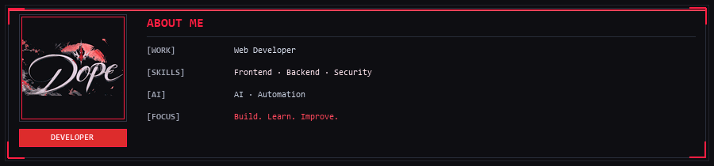

<div align="center">


<br />



<br />

---

<p align="center">
  <a href="https://discord.com/users/dopevibez"></a>
  <a href="mailto:dopevibex@gmail.com"></a>
  <a href="https://github.com/dopevibex"></a>
</p>

</div>

<br />

## ⚔️ 01 // IDENTITY & OPERATING DIRECTIVE

Full-Stack Developer and defensive systems engineer crafting resilient web architectures, high-performance backends, and hardened digital interfaces.

Focused on **Next.js**, **React**, **Node.js**, and **PHP 8**, backed by relational SQL and document stores. In parallel, operating in defensive cybersecurity—traffic analysis, log auditing, threat triage, and system hardening to ensure applications remain inviolable under pressure.

```
┌─────────────────────────────────────────────────────────────────────────────┐
│ OPERATOR SPECIFICATION // DOPE                                              │
├─────────────────────┬───────────────────────────────────────────────────────┤
│ Identity            │ DOPE                                                  │
│ GitHub Handle       │ @dopevibex                                            │
│ Primary Disciplines │ Full-Stack Engineering · Defensive Cyber Systems      │
│ Core Frameworks     │ Next.js · React · Node.js · Express · PHP 8 · TS      │
│ Data Persistence    │ MySQL · PostgreSQL · MongoDB                          │
│ Defense Operations  │ Protocol Analysis · SOC Telemetry · System Hardening  │
│ Operating Status    │ Inviolable · Sovereign · Active Development           │
└─────────────────────┴───────────────────────────────────────────────────────┘
```

<br />

---

## 🗡️ 02 // TACTICAL ARSENAL

Battle-tested technologies across frontend, backend, database engines, and defensive infrastructure:

### `CORE WEAPONS // FRONTEND & INTERFACE`
- **Languages & Frameworks:** JavaScript (ES6+), TypeScript, React, Next.js (App Router, SSR, SSG)
- **Styling & Layout:** Modern CSS3 (Grid/Flexbox), Tailwind CSS, Bootstrap 5, Semantic HTML5
- **Interactive UI:** DOM Scripting, Custom Canvas, Hardware-Accelerated Animations

### `SERVER RUNTIMES // BACKEND & APIs`
- **Server Engines:** Node.js, Express.js, PHP 8 (OOP, Session Architecture, Prepared Queries)
- **API Architecture:** RESTful Endpoints, Asynchronous Pipelines, Secure Payloads, Middleware Routing

### `DATA PERSISTENCE // DATABASES`
- **Relational RDBMS:** MySQL, PostgreSQL (Schema Design, Indexing, Joins, Query Optimization)
- **Document Store:** MongoDB (Collections, Aggregation Pipelines)

### `DEFENSIVE SHIELD // CYBER & INFRASTRUCTURE`
- **Security Operations:** Network Protocol Analysis, Log Auditing, Incident Triage, Vulnerability Mitigation
- **DevOps & CLI:** Git Version Control, GitHub CI/CD Workflows, Linux Bash Automation, VS Code

### `AI SYSTEMS & WORKFLOWS`
- **Agentic Engineering:** Model Context Protocol (MCP), Multi-Agent Development Workflows, Context Optimization

<br />

---

<br />

<div align="center">

<sub>DEVELOPER · INVIOLABLE · SOVEREIGN</sub>

<br />

*“Code with precision, defend with vigilance, build without compromise.”*

</div>