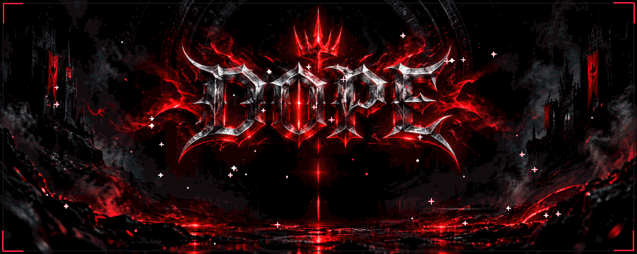

<div align="center">



<br />

```diff
+ OPERATOR: DOPE (Rashid Ali)
+ DISCIPLINE: Full-Stack Engineering & Cyber Defense
+ ACADEMIC: Bachelor of Information Technology (BUITEMS)
+ FOCUS: Next.js · React · Node.js · PHP · Defensive Security
```

---

<p align="center">
  <a href="https://vubix.duckdns.org/"></a>
  <a href="https://discord.com/users/dopevibez"></a>
  <a href="mailto:dopevibex@gmail.com"></a>
  <a href="https://rashidali.is-a.dev"></a>
</p>

</div>

<br />

## ⚔️ 01 // IDENTITY & OPERATING DIRECTIVE

Full-Stack Developer and IT Graduate with hands-on experience spanning modern web application engineering, scalable API architecture, and defensive cybersecurity operations.

I build fast, resilient web applications using **Next.js**, **React**, **Node.js**, and **PHP**, backed by relational SQL and document databases. In parallel, I focus on defensive security—conducting network traffic analysis, log auditing, threat triage, and system hardening to ensure applications remain solid in production.

```
┌─────────────────────────────────────────────────────────────────────────────┐
│ PROFILE SPECIFICATION                                                       │
├─────────────────────┬───────────────────────────────────────────────────────┤
│ Identity            │ DOPE / Rashid Ali                                     │
│ GitHub Handle       │ @dopevibex                                            │
│ Primary Stacks      │ Next.js · React · Node.js · PHP · TypeScript · MySQL  │
│ Defensive Security  │ Traffic Analysis · SOC Telemetry · System Hardening   │
│ Education           │ Bachelor of Information Technology (BUITEMS)          │
│ Certification       │ Front-End Development (SMIT) · Full-Stack Web (DTAN) │
│ Status              │ Engineering production software & security tooling    │
└─────────────────────┴───────────────────────────────────────────────────────┘
```

<br />

---

## 🗡️ 02 // TACTICAL ARSENAL

Battle-tested technologies and tools across frontend, backend, database management, and security infrastructure:

### `CORE WEAPONS // FRONTEND`
- **Languages & Frameworks:** JavaScript (ES6+), TypeScript, React, Next.js (App Router, SSR, SSG)
- **Styling & Layout:** Modern CSS3 (Flexbox/Grid), Tailwind CSS, Bootstrap 5, Semantic HTML5
- **DOM & Animation:** DOM Scripting, jQuery, Interactive Canvas

### `SERVER RUNTIMES // BACKEND & APIs`
- **Server Engines:** Node.js, Express.js, PHP 8 (OOP, Session Handling, Prepared Queries)
- **API Architecture:** RESTful Endpoints, Asynchronous Pipelines, JSON Payloads, Middleware Routing

### `DATA PERSISTENCE // DATABASES`
- **Relational RDBMS:** MySQL, PostgreSQL (Schema Design, Indexing, Joins, Query Optimization)
- **Document Store:** MongoDB (Collections, Aggregation Pipelines)

### `DEFENSIVE SHIELD // CYBER & INFRASTRUCTURE`
- **Security Operations:** Network Protocol Analysis, Log Auditing, Incident Triage, Vulnerability Mitigation
- **DevOps & CLI:** Git Version Control, GitHub CI/CD Workflows, Linux Bash Automation, VS Code

### `AI SYSTEMS & WORKFLOWS`
- **Agentic Engineering:** Model Context Protocol (MCP), Multi-Agent Development Workflows, Context Optimization

<br />

---

## 🔮 03 // COMBAT ARTIFACTS (FEATURED WORK)

<table>
  <tr>
    <td width="50%" valign="top">
      <h3 align="center">🎬 VUBIX ENTERTAINMENT PLATFORM</h3>
      <p align="center">
        <b>Production Media Streaming & Indexing Engine</b><br />
        <a href="https://vubix.duckdns.org/"><b>[ Launch Live Platform ]</b></a>
      </p>
      <ul>
        <li>All-in-one responsive platform to search, browse, and stream movies, TV shows, anime, and manga online.</li>
        <li>Architected with Next.js and Tailwind CSS for rapid navigation, smooth media playback, and zero clutter.</li>
        <li><b>Stack:</b> Next.js · React · Tailwind CSS · REST APIs</li>
      </ul>
    </td>
    <td width="50%" valign="top">
      <h3 align="center">🩸 DEMONIC DEVELOPER PORTFOLIO</h3>
      <p align="center">
        <b>Dark Gothic 3D Interactive Portfolio</b><br />
        <a href="https://github.com/dopevibex/portfolio"><b>[ View Repository ]</b></a>
      </p>
      <ul>
        <li>Cinematic dark fantasy developer portfolio with hardware-accelerated animations and gothic typography.</li>
        <li>Interactive identity stages, dynamic skill marquee systems, and contact nexus.</li>
        <li><b>Stack:</b> Modern JavaScript · GSAP · WebGL · Custom CSS</li>
      </ul>
    </td>
  </tr>
</table>

<br />

---

## 📡 04 // TRANSMISSION NEXUS

Open for high-impact software engineering, web application builds, and defensive security collaboration:

```
┌─────────────────────────────────────────────────────────────────────────────┐
│ DIRECT CHANNELS                                                             │
├───────────────────┬────────────────────────────┬────────────────────────────┤
│ Discord           │ dopevibez                  │ https://discord.com/users/dopevibez │
│ Primary Email     │ dopevibex@gmail.com        │ mailto:dopevibex@gmail.com │
│ Live Portfolio    │ rashidali.is-a.dev         │ https://rashidali.is-a.dev │
│ LinkedIn          │ rashidalix                 │ https://linkedin.com/in/rashidalix │
│ GitHub Profile    │ dopevibex                  │ https://github.com/dopevibex │
└───────────────────┴────────────────────────────┴────────────────────────────┘
```

<br />

<div align="center">

<sub>DEVELOPER · INVIOLABLE · SOVEREIGN</sub>

<br />

*“Code with precision, defend with vigilance, build without compromise.”*

</div>